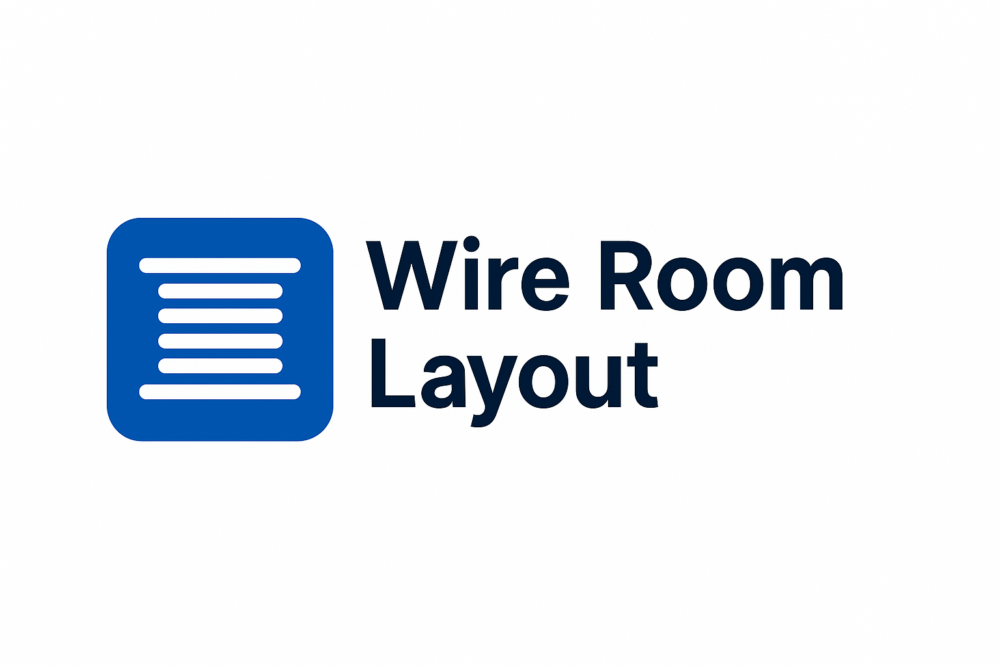

# Wire Room Racking & Reel Location Tool

A visual, interactive inventory layout for racking bins and reel rows with drag-and-drop organization.

## Run Locally

**Prerequisites:**  Node.js

1. Install dependencies:
   `npm install`
2. Run the app:
   `npm run dev`

## Deployment

This app is configured for GitHub Pages and deploys automatically on push to the `main` branch.
